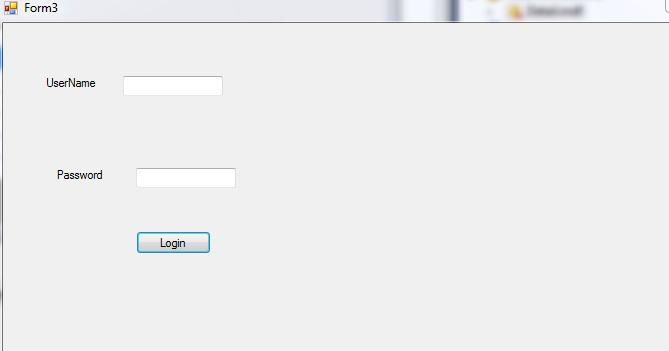

# Registration-Login-in-Windows-Form-Dotnet
Allow the user to do registration.The Registered data of user will be stored in database.Login of user will be authenticated based on that data.After user successfully login,it allow user to Update,Delete,Change Password.
# Screenshot:
# Registration 

                 
# Login

